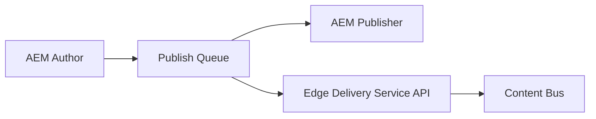

# Pricefx.com (Phase 1)
www.pricefx.com on Adobe's AEM Edge Delivery Services.

## Environments


| Type                                                                              | Description                                                                                                                                     |
| -------------------------------------------------------------------------------------- | ----------------------------------------------------------------------------------------------------------------------------------------------- |
| [`preview`](https://main--pricefx-eds--pricefx.hlx.page/) | `.hlx.page` creates a preview of contents and is automatically created for each branch for content preview and testing.                                               |
| [`live`](https://main--pricefx-eds--pricefx.hlx.live/) | `.hlx.live` is the live/product ready enviroment for published content. |

### Publishing pipeline




## Getting started

See the links below for the steps needed to develop/contribute to this repo.

- [Setup](#setup)
- [Installing dependencies](#installing-dependencies)
- [Common tasks](#common-tasks)
- [Submitting a Pull Request](#submitting-a-pull-request)
- [Resources](#resources)

## Setup

Our repository requires that a forked repo is used for any work before
contributing back to the repository. This includes regular team members/maintainers.

1. Fork the project by navigating to the main
[repository](https://github.com/pricefx/pricefx-eds) and
clicking the **Fork** button on the top-right corner.
2. Navigate to your forked repository and copy the **SSH url**. Clone your fork
by running the following in your terminal:
    
    ```
    $ git clone github.com:{ YOUR_USERNAME }/pricefx-eds.git
    $ cd pricefx-eds
    ```
    
    See [GitHub docs](https://help.github.com/articles/fork-a-repo/) for more
    details on forking a repository.
   
3. Once cloned, you will see `origin` as your default remote, pointing to your
personal forked repository. Add a remote named `upstream` pointing to the
main `pricefx-eds`:
    
    ```
    $ git remote add upstream git@github.com:pricefx/pricefx-eds.git
    $ git remote -v
    ```
    
4. Switch to our version of Node. The currently supported node versions are
listed within the package.json file under the "engines" key.


## Installing dependencies

1. Verify the main changes on the repo such as fstab.yaml & paths.json
2. Install the [AEM CLI](https://github.com/adobe/helix-cli).
   
    ```
    npm install -g @adobe/aem-cli
    ``` 
4. Add the [AEM Code Sync GitHub App](https://github.com/apps/aem-code-sync) to the repository - Only if you are using new/fork repository
5. In order for you to install all the dependencies in this project, you'll need to
[install NPM]([https://yarnpkg.com/en/docs/install](https://docs.npmjs.com/downloading-and-installing-node-js-and-npm)) and run the following
command in your terminal:

    ```
    npm install
    ```

5. Start AEM Simulator: This opens http://localhost:3000/ and you are ready to make changes.

    ```
    aem up
    ```

You're all set and ready to start developing locally! 

A good place to start is in the blocks folder which is where most of the styling and code developed for this project. Simply make a change in a `.css` or `.js` and you should see the changes in your browser immediately.

## Common Tasks

While working on the project, here are some of the top-level tasks that you might want to run:

| Command                    | Usage                                               |
| -------------------------- | --------------------------------------------------- |
| `npm run test`             | Run active tests                                    |
| `npm run lint`             | Run linting checks (CSS & JS)                       |
| `npm run lint:js`          | Run linting checks for JavaScript files             |
| `npm run lint:js -- --fix` | Fix linting errors in JavaScript files              |
| `npm run lint:css`         | Run linting checks for CSS files                    |
| `npm run lint:css -- --fix`| Fix linting errors in CSS files                     |


Running `npm run test` executes active tests to ensure the project functionality is intact. The `npm run lint` command checks both CSS and JavaScript for any linting errors. 

To specifically fix linting errors in JavaScript files, use `npm run lint:js -- --fix`. For CSS files, use `npm run lint:css -- --fix`.

In addition, `npm run build` can be used to build the project, and `npm run deploy` to deploy it.


## Submitting a Pull Request

1. Pull the latest main branch from `upstream`:
    
    ```
    $ git pull upstream main
    ```
    
2. Always work and submit pull requests from a branch. *Do not submit pull
requests from the `main` branch of your fork*.
    
    ```
    $ git checkout -b { YOUR_BRANCH_NAME } main
    
    ```
    
3. Create your patch or feature.
4. Test your branch and add new test cases where appropriate.
5. Commit your changes using a descriptive commit message.
    
    ```
    $ git commit -m "fix(component-name): Update header with newest designs"
    ```
    
    **Note:** the optional commit -a command-line option will automatically "add"
    and "rm" edited files. See
    [Close a commit via commit message](https://help.github.com/articles/closing-issues-via-commit-messages/)
    and
    [writing good commit messages](https://github.com/erlang/otp/wiki/Writing-good-commit-messages)
    for more details on commit messages.
    
    This project uses a commit format called
    [Conventional Commits](https://www.conventionalcommits.org/). This format is
    used to help automate details about our project and how it changes. When
    committing changes, there will be a tool that automatically looks at commits
    and will check to see if the commit matches the format defined by
    Conventional Commits.
    
6. Once ready for feedback from other contributors and maintainers, **push your
commits to your fork** (be sure to run `npm run lint` and `npm run test` before pushing, to
make sure your code passes linting and unit tests):
    
    ```
    $ git push origin { YOUR_BRANCH_NAME }
    ```
    
7. In Github, navigate to
[https://github.com/pricefx/pricefx-eds](https://github.com/pricefx/pricefx-eds.git)
and click the button that reads "Compare & pull request".
8. Write a title and description, then click "Create pull request".
    
    Follow the PR template defined for the project.
    
9. Stay up to date with the activity in your pull request. Maintainers will be
reviewing your work and making comments, asking questions, and suggesting
changes to be made before they merge your code. 
10. When you need to make a
change, add, commit and push to your branch normally.
    
    Once all revisions to your pull request are complete, a maintainer will
    squash and merge your commits for you.
    
## Resources
    
- [Docs](https://www.hlx.live/docs/)
- [FAQs](https://www.hlx.live/docs/faq)
